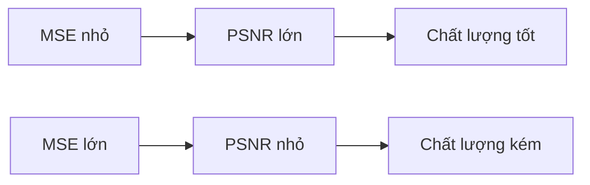
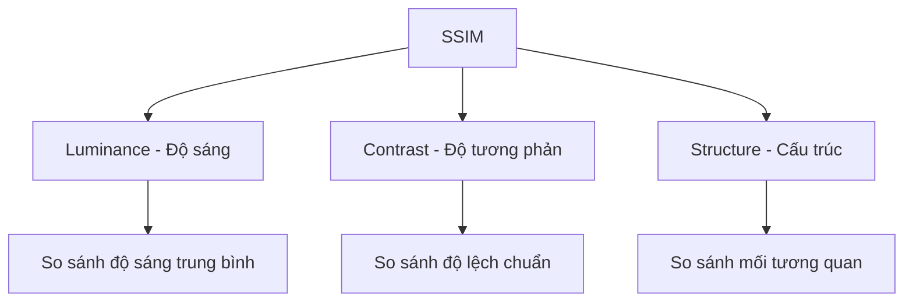
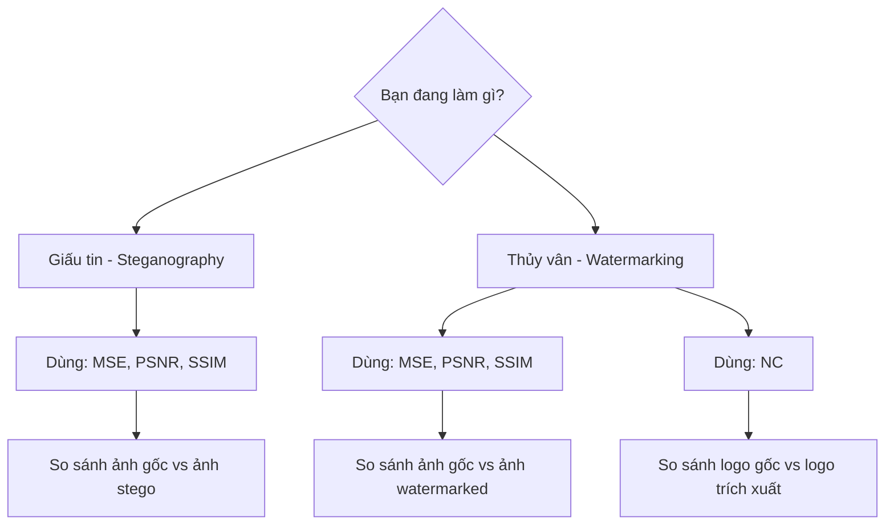

# 📊 Giải thích Các Độ đo Chất lượng Ảnh

## 🎯 Tổng quan

Khi nhúng tin hoặc thủy vân vào ảnh, chúng ta cần đánh giá:
1. **Ảnh có bị hỏng không?** → MSE, PSNR, SSIM
2. **Logo còn nguyên vẹn không?** → NC

Tài liệu này giải thích 4 độ đo quan trọng nhất.

---

## 📏 1. MSE (Mean Squared Error - Sai số Bình phương Trung bình)

### MSE là gì?

**Định nghĩa đơn giản**: MSE đo "mức độ khác biệt" giữa 2 ảnh bằng cách tính trung bình bình phương của sự chênh lệch từng pixel.

**Ví dụ đời thường**: 
Giống như so sánh 2 bức tranh vẽ tay:
- Nếu 2 tranh giống hệt nhau → MSE = 0
- Nếu 2 tranh khác nhau nhiều → MSE lớn

### Công thức toán học

```
MSE = (1 / (H × W)) × Σ Σ [Original(i,j) - Modified(i,j)]²
                        i=0 j=0

Trong đó:
- H: Chiều cao ảnh (số hàng pixel)
- W: Chiều rộng ảnh (số cột pixel)
- Original(i,j): Giá trị pixel gốc tại vị trí (i,j)
- Modified(i,j): Giá trị pixel đã chỉnh sửa tại vị trí (i,j)
- Σ: Tổng tất cả các pixel
```

### Ví dụ cụ thể với ảnh nhỏ 3×3

**Ảnh gốc:**
```
100  120  140
110  130  150
120  140  160
```

**Ảnh sau khi nhúng watermark:**
```
101  121  139
110  131  149
121  140  161
```

**Tính MSE từng bước:**

```
Bước 1: Tính chênh lệch từng pixel
(101-100)² = 1² = 1
(121-120)² = 1² = 1
(139-140)² = (-1)² = 1
(110-110)² = 0² = 0
(131-130)² = 1² = 1
(149-150)² = (-1)² = 1
(121-120)² = 1² = 1
(140-140)² = 0² = 0
(161-160)² = 1² = 1

Bước 2: Tính tổng
Tổng = 1+1+1+0+1+1+1+0+1 = 7

Bước 3: Chia cho số pixel
MSE = 7 / (3×3) = 7/9 = 0.778
```

### Code Python

```python
import numpy as np

def calculate_mse(original, modified):
    """Tính Mean Squared Error"""
    # Chuyển sang float để tránh overflow
    diff = original.astype(float) - modified.astype(float)
    
    # Bình phương
    squared_diff = diff ** 2
    
    # Trung bình
    mse = np.mean(squared_diff)
    
    return mse
```

### Cách đọc kết quả MSE

| MSE | Ý nghĩa | Chất lượng |
|-----|---------|------------|
| 0 | Hai ảnh giống hệt nhau | Hoàn hảo |
| 0-10 | Khác biệt rất nhỏ, không nhìn thấy | Xuất sắc |
| 10-50 | Khác biệt nhỏ, khó nhìn thấy | Tốt |
| 50-100 | Khác biệt trung bình, có thể nhìn thấy | Trung bình |
| >100 | Khác biệt lớn, dễ nhìn thấy | Kém |

**Lưu ý**: MSE càng nhỏ càng tốt!

---

## 📡 2. PSNR (Peak Signal-to-Noise Ratio - Tỷ số Tín hiệu trên Nhiễu)

### PSNR là gì?

**Định nghĩa đơn giản**: PSNR đo "chất lượng" của ảnh sau khi chỉnh sửa so với ảnh gốc. Giá trị càng cao = chất lượng càng tốt.

**Ví dụ đời thường**:
Giống như đo chất lượng âm thanh:
- Radio nhiễu ít → PSNR cao → Nghe rõ
- Radio nhiễu nhiều → PSNR thấp → Nghe khó

### Công thức toán học

```
PSNR = 10 × log₁₀(MAX² / MSE)

Hoặc viết khác:

PSNR = 20 × log₁₀(MAX / √MSE)

Trong đó:
- MAX: Giá trị pixel tối đa (255 cho ảnh 8-bit)
- MSE: Mean Squared Error (tính ở trên)
- log₁₀: Logarit cơ số 10
```

### Tại sao dùng logarit?

Vì mắt người cảm nhận theo thang logarit, không phải tuyến tính:
- Chênh lệch 1→2 và 100→200 đều là gấp đôi
- Logarit giúp biểu diễn điều này

### Ví dụ tính toán

**Từ ví dụ MSE = 0.778 ở trên:**

```
Bước 1: Tính MAX²
MAX = 255 (ảnh 8-bit)
MAX² = 255² = 65,025

Bước 2: Tính MAX² / MSE
65,025 / 0.778 = 83,591

Bước 3: Tính log₁₀
log₁₀(83,591) = 4.922

Bước 4: Nhân 10
PSNR = 10 × 4.922 = 49.22 dB
```

**Kết luận**: PSNR = 49.22 dB → Chất lượng xuất sắc!

### Code Python

```python
import numpy as np

def calculate_psnr(original, modified, max_pixel=255.0):
    """Tính Peak Signal-to-Noise Ratio"""
    # Tính MSE
    mse = np.mean((original.astype(float) - modified.astype(float)) ** 2)
    
    # Nếu MSE = 0 → 2 ảnh giống hệt
    if mse == 0:
        return float('inf')  # Vô cùng
    
    # Tính PSNR
    psnr = 20 * np.log10(max_pixel / np.sqrt(mse))
    
    return psnr
```

### Cách đọc kết quả PSNR

| PSNR (dB) | Ý nghĩa | Chất lượng |
|-----------|---------|------------|
| >50 | Không nhìn thấy khác biệt | Xuất sắc ⭐⭐⭐⭐⭐ |
| 40-50 | Khác biệt rất nhỏ | Tốt ⭐⭐⭐⭐ |
| 30-40 | Khác biệt nhỏ, chấp nhận được | Trung bình ⭐⭐⭐ |
| 20-30 | Khác biệt rõ ràng | Kém ⭐⭐ |
| <20 | Khác biệt lớn | Rất kém ⭐ |

**Lưu ý**: PSNR càng cao càng tốt! (Ngược với MSE)

### So sánh MSE vs PSNR



---

## 🔍 3. SSIM (Structural Similarity Index - Chỉ số Tương đồng Cấu trúc)

### SSIM là gì?

**Định nghĩa đơn giản**: SSIM đo "độ giống nhau về cấu trúc" giữa 2 ảnh, dựa trên cách mắt người nhìn.

**Khác với MSE/PSNR**: 
- MSE/PSNR: Chỉ so sánh từng pixel riêng lẻ
- SSIM: So sánh cả vùng lân cận, giống cách mắt người nhìn

**Ví dụ đời thường**:
Hai bức ảnh có thể có MSE giống nhau nhưng:
- Ảnh A: Nhiễu đều khắp nơi → Mắt người thấy khó chịu
- Ảnh B: Nhiễu tập trung 1 góc → Mắt người chấp nhận được
→ SSIM của ảnh B cao hơn!

### SSIM xét 3 yếu tố



### Công thức toán học (Đơn giản hóa)

```
SSIM(x, y) = [l(x,y)]^α × [c(x,y)]^β × [s(x,y)]^γ

Trong đó:
- l(x,y): Luminance comparison (so sánh độ sáng)
- c(x,y): Contrast comparison (so sánh độ tương phản)
- s(x,y): Structure comparison (so sánh cấu trúc)
- α, β, γ: Trọng số (thường = 1)

Công thức đầy đủ:
SSIM(x,y) = [(2μₓμᵧ + C₁)(2σₓᵧ + C₂)] / [(μₓ² + μᵧ² + C₁)(σₓ² + σᵧ² + C₂)]

Trong đó:
- μₓ, μᵧ: Giá trị trung bình của x và y
- σₓ, σᵧ: Độ lệch chuẩn của x và y
- σₓᵧ: Covariance giữa x và y
- C₁, C₂: Hằng số nhỏ để tránh chia cho 0
```

### Ví dụ tính toán đơn giản

**Vùng 3×3 của ảnh gốc:**
```
100  110  120
105  115  125
110  120  130
```

**Vùng 3×3 của ảnh watermarked:**
```
101  111  121
106  116  126
111  121  131
```

**Tính toán:**

```
Bước 1: Tính giá trị trung bình
μₓ = (100+110+120+105+115+125+110+120+130) / 9 = 115
μᵧ = (101+111+121+106+116+126+111+121+131) / 9 = 116

Bước 2: Tính độ lệch chuẩn
σₓ = √[Σ(xᵢ - μₓ)² / 9] ≈ 10.0
σᵧ = √[Σ(yᵢ - μᵧ)² / 9] ≈ 10.0

Bước 3: Tính covariance
σₓᵧ = Σ[(xᵢ - μₓ)(yᵢ - μᵧ)] / 9 ≈ 100

Bước 4: Áp dụng công thức (giả sử C₁=1, C₂=1)
SSIM = [(2×115×116 + 1)(2×100 + 1)] / [(115² + 116² + 1)(10² + 10² + 1)]
     = [26,681 × 201] / [27,082 × 201]
     ≈ 0.985
```

### Code Python

```python
from skimage.metrics import structural_similarity as ssim
import cv2

def calculate_ssim(original, modified):
    """Tính Structural Similarity Index"""
    # Chuyển sang grayscale nếu là ảnh màu
    if len(original.shape) == 3:
        original_gray = cv2.cvtColor(original, cv2.COLOR_BGR2GRAY)
        modified_gray = cv2.cvtColor(modified, cv2.COLOR_BGR2GRAY)
    else:
        original_gray = original
        modified_gray = modified
    
    # Tính SSIM
    ssim_value = ssim(original_gray, modified_gray, 
                      data_range=modified_gray.max() - modified_gray.min())
    
    return ssim_value
```

### Cách đọc kết quả SSIM

| SSIM | Ý nghĩa | Chất lượng |
|------|---------|------------|
| 1.0 | Hai ảnh giống hệt nhau | Hoàn hảo ⭐⭐⭐⭐⭐ |
| 0.95-1.0 | Rất giống, khó phân biệt | Xuất sắc ⭐⭐⭐⭐⭐ |
| 0.90-0.95 | Giống, chấp nhận được | Tốt ⭐⭐⭐⭐ |
| 0.80-0.90 | Khác biệt nhỏ | Trung bình ⭐⭐⭐ |
| <0.80 | Khác biệt rõ ràng | Kém ⭐⭐ |

**Lưu ý**: SSIM càng gần 1 càng tốt!

### Tại sao SSIM tốt hơn PSNR?

**Ví dụ minh họa:**

```
Ảnh gốc: [100, 100, 100, 100]

Ảnh A: [101, 101, 101, 101]  (Dịch đều +1)
→ MSE = 1, PSNR = 48 dB
→ SSIM ≈ 0.99 (Cấu trúc giữ nguyên)

Ảnh B: [100, 100, 100, 104]  (Chỉ 1 pixel +4)
→ MSE = 4, PSNR = 42 dB
→ SSIM ≈ 0.85 (Cấu trúc thay đổi)

Mắt người: Ảnh A đẹp hơn ảnh B
→ SSIM phản ánh đúng, PSNR không!
```

---

## 🎯 4. NC (Normalized Correlation - Tương quan Chuẩn hóa)

### NC là gì?

**Định nghĩa đơn giản**: NC đo "độ giống nhau" giữa logo gốc và logo trích xuất sau khi bị tấn công.

**Dùng khi nào**: Chỉ dùng cho watermarking, không dùng cho steganography.

**Ví dụ đời thường**:
Giống như so sánh 2 chữ ký:
- Chữ ký giống hệt → NC = 1
- Chữ ký khác hoàn toàn → NC = 0
- Chữ ký giống 80% → NC = 0.8

### Công thức toán học

```
NC = Σ Σ [W(i,j) × W'(i,j)] / √[Σ Σ W(i,j)² × Σ Σ W'(i,j)²]
     i j                        i j           i j

Trong đó:
- W(i,j): Logo gốc tại pixel (i,j)
- W'(i,j): Logo trích xuất tại pixel (i,j)
- Σ: Tổng tất cả các pixel
```

### Ví dụ cụ thể

**Logo gốc (4×4):**
```
1  1  0  0
1  1  0  0
0  0  1  1
0  0  1  1
```

**Logo trích xuất (sau tấn công JPEG):**
```
1  1  0  0
1  0  0  1
0  0  1  1
0  1  1  1
```

**Tính NC từng bước:**

```
Bước 1: Tính tích từng pixel
1×1=1, 1×1=1, 0×0=0, 0×0=0
1×1=1, 1×0=0, 0×0=0, 0×1=0
0×0=0, 0×0=0, 1×1=1, 1×1=1
0×0=0, 0×1=0, 1×1=1, 1×1=1

Tổng tích = 1+1+0+0+1+0+0+0+0+0+1+1+0+0+1+1 = 7

Bước 2: Tính tổng bình phương logo gốc
1²+1²+0²+0²+1²+1²+0²+0²+0²+0²+1²+1²+0²+0²+1²+1² = 8

Bước 3: Tính tổng bình phương logo trích xuất
1²+1²+0²+0²+1²+0²+0²+1²+0²+0²+1²+1²+0²+1²+1²+1² = 9

Bước 4: Tính NC
NC = 7 / √(8 × 9) = 7 / √72 = 7 / 8.485 = 0.825
```

**Kết luận**: NC = 0.825 → Logo còn 82.5% nguyên vẹn!

### Code Python

```python
import numpy as np

def calculate_nc(original_watermark, extracted_watermark):
    """Tính Normalized Correlation"""
    # Flatten thành 1D array
    original_flat = original_watermark.flatten().astype(float)
    extracted_flat = extracted_watermark.flatten().astype(float)
    
    # Tính tử số: Σ(W × W')
    numerator = np.sum(original_flat * extracted_flat)
    
    # Tính mẫu số: √(Σ W² × Σ W'²)
    denominator = np.sqrt(
        np.sum(original_flat ** 2) * np.sum(extracted_flat ** 2)
    )
    
    # Tránh chia cho 0
    if denominator == 0:
        return 0.0
    
    nc = numerator / denominator
    
    return nc
```

### Cách đọc kết quả NC

| NC | Ý nghĩa | Chất lượng Watermark |
|----|---------|----------------------|
| 1.0 | Logo giống hệt nhau | Hoàn hảo ⭐⭐⭐⭐⭐ |
| 0.9-1.0 | Logo gần như nguyên vẹn | Xuất sắc ⭐⭐⭐⭐⭐ |
| 0.7-0.9 | Logo còn nhận ra được | Tốt ⭐⭐⭐⭐ |
| 0.5-0.7 | Logo bị hỏng nhưng còn thấy | Trung bình ⭐⭐⭐ |
| <0.5 | Logo bị hỏng nặng | Kém ⭐⭐ |

**Lưu ý**: NC càng gần 1 càng tốt!

### NC trong các tình huống tấn công

```
Logo gốc → Nhúng vào ảnh → Tấn công → Trích xuất → So sánh

Không tấn công:
NC ≈ 0.98-1.0 (Gần như hoàn hảo)

JPEG Quality 90%:
NC ≈ 0.95-0.98 (Xuất sắc)

JPEG Quality 50%:
NC ≈ 0.85-0.95 (Tốt)

Gaussian Noise (std=25):
NC ≈ 0.80-0.90 (Tốt)

Crop 20%:
NC ≈ 0.75-0.85 (Chấp nhận được)

Crop 50%:
NC ≈ 0.50-0.70 (Kém)
```

---

## 📊 So sánh 4 Độ đo

| Độ đo | Dùng cho | Giá trị tốt | Ý nghĩa | Ưu điểm | Nhược điểm |
|-------|----------|-------------|---------|---------|------------|
| **MSE** | So sánh ảnh | Càng nhỏ càng tốt (0 là tốt nhất) | Sai số trung bình | Đơn giản, nhanh | Không phản ánh cảm nhận mắt người |
| **PSNR** | So sánh ảnh | Càng lớn càng tốt (>40 dB là tốt) | Tỷ số tín hiệu/nhiễu | Dễ hiểu, phổ biến | Không phản ánh cảm nhận mắt người |
| **SSIM** | So sánh ảnh | Càng gần 1 càng tốt | Độ giống về cấu trúc | Phản ánh cảm nhận mắt người | Phức tạp, chậm hơn |
| **NC** | So sánh logo | Càng gần 1 càng tốt | Độ tương quan | Đánh giá độ bền watermark | Chỉ dùng cho watermarking |

### Khi nào dùng độ đo nào?



---

## 🎓 Ví dụ Thực tế Hoàn chỉnh

### Tình huống: Nhúng logo vào ảnh

```python
import cv2
import numpy as np
from core.watermarking import DCT_SVD_Watermark
from core.utils import calculate_psnr, calculate_ssim, calculate_nc

# 1. Nhúng watermark
watermarker = DCT_SVD_Watermark(alpha=0.1)
watermarker.embed('original.png', 'logo.png', 'watermarked.png')

# 2. Đọc ảnh
original = cv2.imread('original.png')
watermarked = cv2.imread('watermarked.png')

# 3. Tính MSE
mse = np.mean((original.astype(float) - watermarked.astype(float)) ** 2)
print(f"MSE: {mse:.2f}")
# Output: MSE: 1.23

# 4. Tính PSNR
psnr = calculate_psnr(original, watermarked)
print(f"PSNR: {psnr:.2f} dB")
# Output: PSNR: 47.23 dB

# 5. Tính SSIM
ssim_value = calculate_ssim(original, watermarked)
print(f"SSIM: {ssim_value:.4f}")
# Output: SSIM: 0.9912

# 6. Tấn công JPEG
encode_param = [int(cv2.IMWRITE_JPEG_QUALITY), 50]
_, encimg = cv2.imencode('.jpg', watermarked, encode_param)
attacked = cv2.imdecode(encimg, cv2.IMREAD_COLOR)
cv2.imwrite('attacked.png', attacked)

# 7. Trích xuất logo
logo_original = cv2.imread('logo.png', cv2.IMREAD_GRAYSCALE)
logo_extracted = watermarker.extract('attacked.png', 'original.png', 32)

# 8. Tính NC
nc = calculate_nc(logo_original, logo_extracted)
print(f"NC: {nc:.4f}")
# Output: NC: 0.9234

# 9. Đánh giá
print("\n=== ĐÁNH GIÁ ===")
print(f"Chất lượng ảnh watermarked: {'Xuất sắc' if psnr > 40 else 'Tốt'}")
print(f"Độ bền watermark sau JPEG: {'Bền' if nc > 0.7 else 'Không bền'}")
```

**Kết quả:**
```
MSE: 1.23
PSNR: 47.23 dB
SSIM: 0.9912
NC: 0.9234

=== ĐÁNH GIÁ ===
Chất lượng ảnh watermarked: Xuất sắc
Độ bền watermark sau JPEG: Bền
```

---

## 🎯 Tóm tắt

### Nhớ nhanh 4 độ đo

1. **MSE**: Sai số trung bình → Càng nhỏ càng tốt
2. **PSNR**: Tỷ số tín hiệu/nhiễu → Càng lớn càng tốt (>40 dB)
3. **SSIM**: Độ giống cấu trúc → Càng gần 1 càng tốt (>0.95)
4. **NC**: Độ giống logo → Càng gần 1 càng tốt (>0.7)

### Công thức đơn giản

```
MSE nhỏ → PSNR lớn → SSIM gần 1 → Chất lượng tốt

NC gần 1 → Logo nguyên vẹn → Watermark bền
```

### Khi báo cáo kết quả

**Giấu tin (Steganography):**
- "PSNR = 52.3 dB, SSIM = 0.998 → Ảnh stego không phân biệt được với ảnh gốc"

**Thủy vân (Watermarking):**
- "PSNR = 42.1 dB, SSIM = 0.990 → Ảnh watermarked chất lượng cao"
- "NC = 0.92 sau JPEG 50% → Watermark bền vững với nén"

---

## 📚 Tài liệu tham khảo

- MSE & PSNR: Huynh-Thu & Ghanbari (2008)
- SSIM: Wang et al. (2004) - "Image Quality Assessment"
- NC: Cox et al. (1997) - "Secure Spread Spectrum Watermarking"

---

**Lưu ý**: Các công thức trong tài liệu này được đơn giản hóa để dễ hiểu. Code thực tế có thể có thêm xử lý edge cases và tối ưu hóa.
