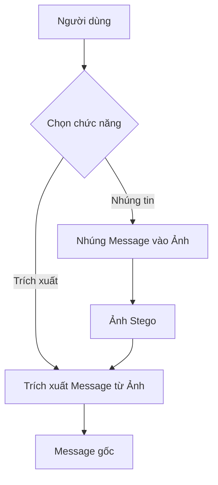
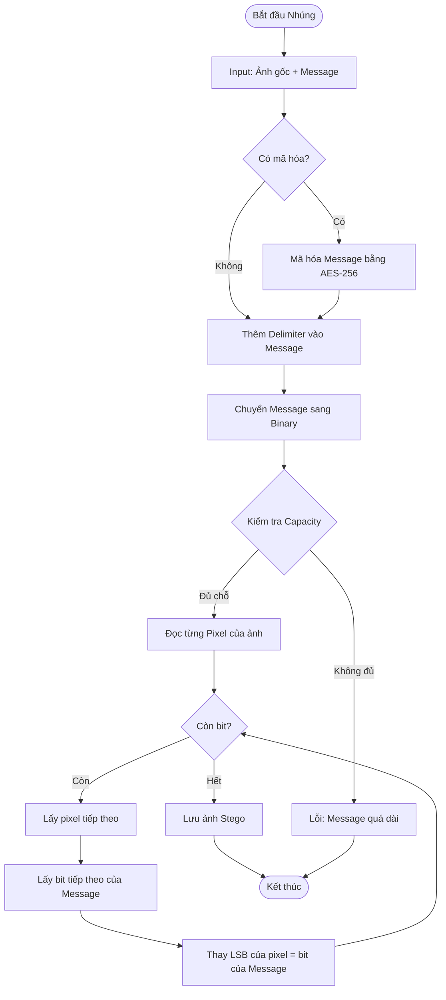
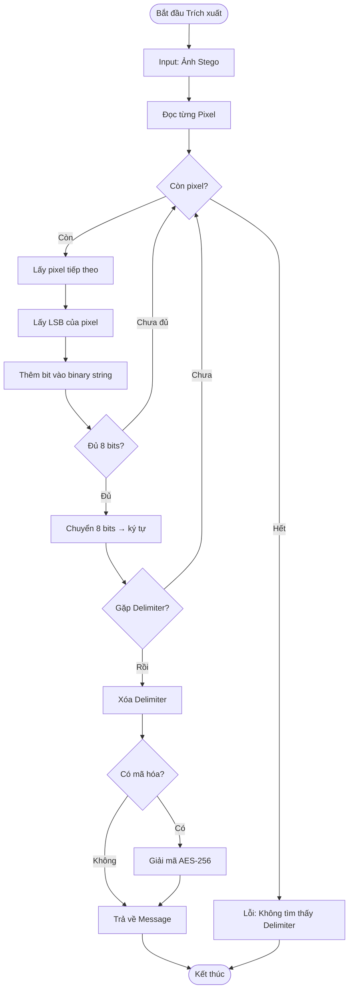
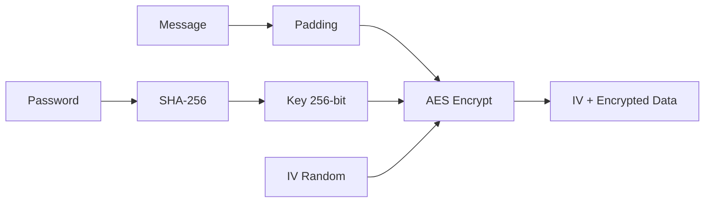
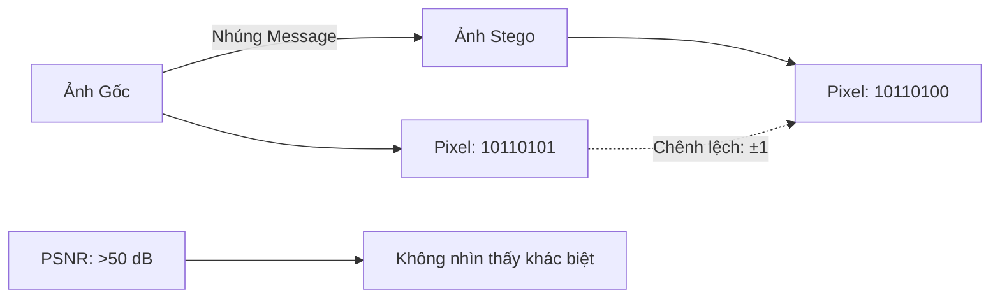

# 📚 Giải thích Chi tiết Code - Giấu tin trong Ảnh (LSB Steganography)

## 🎯 Tổng quan

**Mục đích**: Giấu thông điệp TEXT bí mật vào ảnh sao cho:
- ✅ Không nhìn thấy bằng mắt thường
- ✅ Có thể trích xuất lại được
- ✅ Hỗ trợ mã hóa AES-256

**Thuật toán**: LSB (Least Significant Bit) - Thay thế bit cuối cùng của mỗi pixel

---

## 📊 Sơ đồ Tổng quan



---

## 🔐 Quy trình NHÚNG TIN (Embed)

### Sơ đồ chi tiết



### Code chi tiết từng bước

#### Bước 1: Khởi tạo Class

```python
class LSB_Stego:
    DELIMITER = "<<<END_OF_MESSAGE>>>"  # Dấu hiệu kết thúc
    
    def __init__(self, use_encryption=False, password=None):
        self.use_encryption = use_encryption
        self.password = password
```

**Giải thích:**
- `DELIMITER`: Chuỗi đặc biệt đánh dấu kết thúc message
- `use_encryption`: Có mã hóa hay không
- `password`: Mật khẩu để mã hóa (nếu có)

---

#### Bước 2: Mã hóa Message (Nếu cần)

```python
def _encrypt_message(self, message):
    # Tạo key từ password
    key = hashlib.sha256(self.password.encode()).digest()
    
    # Tạo cipher AES
    cipher = AES.new(key, AES.MODE_CBC)
    
    # Mã hóa
    ct_bytes = cipher.encrypt(pad(message.encode(), AES.block_size))
    
    # Trả về: IV + Encrypted data
    return cipher.iv + ct_bytes
```

**Giải thích:**
1. **SHA-256**: Chuyển password thành key 256-bit
2. **AES CBC**: Mã hóa đối xứng, cần IV (Initialization Vector)
3. **Padding**: Thêm bytes để đủ block size (16 bytes)
4. **Output**: IV (16 bytes) + Encrypted message

**Ví dụ:**
```
Password: "mypass123"
↓ SHA-256
Key: a1b2c3d4... (32 bytes)
↓ AES-CBC
Message: "Hello" → Encrypted: "x9f2a..." (hex)
```

---

#### Bước 3: Chuyển Text sang Binary

```python
def _text_to_binary(self, text):
    return ''.join(format(ord(char), '08b') for char in text)
```

**Giải thích:**
- `ord(char)`: Lấy mã ASCII của ký tự
- `format(..., '08b')`: Chuyển sang binary 8 bit
- `''.join(...)`: Nối tất cả lại

**Ví dụ:**
```
Text: "Hi"
↓
'H' → ASCII 72 → Binary: 01001000
'i' → ASCII 105 → Binary: 01101001
↓
Result: "0100100001101001"
```

---

#### Bước 4: Nhúng vào Pixel

```python
def embed(self, cover_image_path, secret_message, output_path):
    # 1. Đọc ảnh
    image = cv2.imread(cover_image_path)  # Shape: (H, W, 3)
    
    # 2. Chuẩn bị message
    if self.use_encryption:
        encrypted = self._encrypt_message(secret_message)
        message_to_hide = encrypted.hex()  # Chuyển bytes sang hex string
    else:
        message_to_hide = secret_message
    
    message_to_hide += self.DELIMITER  # Thêm delimiter
    binary_message = self._text_to_binary(message_to_hide)
    
    # 3. Kiểm tra capacity
    image_capacity = image.shape[0] * image.shape[1] * 3  # H × W × 3 channels
    if len(binary_message) > image_capacity:
        raise ValueError("Message quá dài!")
    
    # 4. Nhúng từng bit
    data_index = 0
    stego_image = image.copy()
    
    for i in range(image.shape[0]):      # Duyệt từng hàng
        for j in range(image.shape[1]):  # Duyệt từng cột
            for k in range(3):           # Duyệt 3 channels (B, G, R)
                if data_index < len(binary_message):
                    # Thay LSB
                    pixel_value = image[i, j, k]
                    message_bit = int(binary_message[data_index])
                    
                    # Công thức: (pixel & 0xFE) | message_bit
                    stego_image[i, j, k] = (pixel_value & 0xFE) | message_bit
                    
                    data_index += 1
    
    # 5. Lưu ảnh
    cv2.imwrite(output_path, stego_image)
```

**Giải thích chi tiết công thức:**

```
Pixel gốc:     10110101 (181)
               ^^^^^^^^
               |||||||└─ LSB (bit cuối)
               
Bước 1: pixel & 0xFE
0xFE = 11111110 (254)

  10110101  (pixel)
& 11111110  (0xFE)
-----------
  10110100  (LSB = 0)

Bước 2: | message_bit
Nếu message_bit = 1:

  10110100
| 00000001
-----------
  10110101  (LSB = 1)

Kết quả: LSB được thay = message_bit
```

**Ví dụ cụ thể:**

```
Ảnh 3×3 pixels, Message: "A"

'A' → ASCII 65 → Binary: 01000001

Pixel[0,0,B] = 150 → 10010110 → Thay LSB=0 → 10010110 (150)
Pixel[0,0,G] = 200 → 11001000 → Thay LSB=1 → 11001001 (201)
Pixel[0,0,R] = 100 → 01100100 → Thay LSB=0 → 01100100 (100)
Pixel[0,1,B] = 180 → 10110100 → Thay LSB=0 → 10110100 (180)
Pixel[0,1,G] = 220 → 11011100 → Thay LSB=0 → 11011100 (220)
Pixel[0,1,R] = 90  → 01011010 → Thay LSB=0 → 01011010 (90)
Pixel[0,2,B] = 170 → 10101010 → Thay LSB=0 → 10101010 (170)
Pixel[0,2,G] = 130 → 10000010 → Thay LSB=1 → 10000011 (131)

Thay đổi: 200→201, 130→131 (chỉ ±1, không nhìn thấy!)
```

---

## 🔓 Quy trình TRÍCH XUẤT TIN (Extract)

### Sơ đồ chi tiết



### Code chi tiết

```python
def extract(self, stego_image_path):
    # 1. Đọc ảnh
    image = cv2.imread(stego_image_path)
    
    # 2. Trích xuất LSB
    binary_message = ""
    
    for i in range(image.shape[0]):
        for j in range(image.shape[1]):
            for k in range(3):
                # Lấy LSB: pixel & 1
                lsb = image[i, j, k] & 1
                binary_message += str(lsb)
    
    # 3. Chuyển binary sang text
    all_bytes = [binary_message[i:i+8] for i in range(0, len(binary_message), 8)]
    decoded_message = ""
    
    for byte in all_bytes:
        if len(byte) == 8:
            char = chr(int(byte, 2))  # Binary → ASCII → Char
            decoded_message += char
            
            # Kiểm tra delimiter
            if decoded_message.endswith(self.DELIMITER):
                break
    
    # 4. Xóa delimiter
    decoded_message = decoded_message.replace(self.DELIMITER, "")
    
    # 5. Giải mã (nếu cần)
    if self.use_encryption:
        encrypted_bytes = bytes.fromhex(decoded_message)
        decoded_message = self._decrypt_message(encrypted_bytes)
    
    return decoded_message
```

**Giải thích công thức lấy LSB:**

```
Pixel: 10110101 (181)

pixel & 1:
  10110101
& 00000001
-----------
  00000001  → LSB = 1

Pixel: 10110100 (180)

pixel & 1:
  10110100
& 00000001
-----------
  00000000  → LSB = 0
```

**Ví dụ trích xuất:**

```
Đọc 8 pixels:
Pixel 1: 150 → LSB = 0
Pixel 2: 201 → LSB = 1
Pixel 3: 100 → LSB = 0
Pixel 4: 180 → LSB = 0
Pixel 5: 220 → LSB = 0
Pixel 6: 90  → LSB = 0
Pixel 7: 170 → LSB = 0
Pixel 8: 131 → LSB = 1

Binary: 01000001
↓ Convert
ASCII: 65
↓
Char: 'A'
```

---

## 🔐 Mã hóa AES-256

### Sơ đồ



### Code

```python
def _encrypt_message(self, message):
    # 1. Tạo key từ password
    key = hashlib.sha256(self.password.encode()).digest()
    
    # 2. Tạo cipher với IV ngẫu nhiên
    cipher = AES.new(key, AES.MODE_CBC)
    
    # 3. Padding message
    padded = pad(message.encode(), AES.block_size)
    
    # 4. Mã hóa
    encrypted = cipher.encrypt(padded)
    
    # 5. Trả về IV + encrypted
    return cipher.iv + encrypted

def _decrypt_message(self, encrypted_data):
    # 1. Tách IV và data
    iv = encrypted_data[:16]
    ct = encrypted_data[16:]
    
    # 2. Tạo key từ password
    key = hashlib.sha256(self.password.encode()).digest()
    
    # 3. Tạo cipher với IV
    cipher = AES.new(key, AES.MODE_CBC, iv)
    
    # 4. Giải mã
    decrypted = cipher.decrypt(ct)
    
    # 5. Unpad
    return unpad(decrypted, AES.block_size).decode()
```

---

## 📊 So sánh Ảnh Gốc vs Ảnh Stego



### Tính toán PSNR

```python
def calculate_psnr(original, stego):
    mse = np.mean((original - stego) ** 2)
    if mse == 0:
        return float('inf')
    
    max_pixel = 255.0
    psnr = 20 * np.log10(max_pixel / np.sqrt(mse))
    return psnr
```

**Ví dụ:**
```
MSE = 0.5 (rất nhỏ)
PSNR = 20 × log10(255 / √0.5)
     = 20 × log10(360.6)
     = 20 × 2.557
     = 51.14 dB (Xuất sắc!)
```

---

## 🎯 Tóm tắt

### Nhúng tin:
1. Message → Binary
2. Duyệt từng pixel
3. Thay LSB = bit của message
4. Lưu ảnh Stego

### Trích xuất:
1. Đọc LSB của từng pixel
2. Ghép thành binary string
3. Chuyển binary → text
4. Tìm delimiter và cắt

### Ưu điểm:
- ✅ Đơn giản
- ✅ PSNR rất cao (>50 dB)
- ✅ Không nhìn thấy khác biệt

### Nhược điểm:
- ❌ Dễ bị phát hiện bằng phân tích thống kê
- ❌ Không bền với JPEG compression
- ❌ Dễ bị phá hủy khi crop/resize

---

## 📚 Tài liệu tham khảo

- LSB Steganography: Chan & Cheng (2004)
- AES Encryption: NIST FIPS 197
- OpenCV Documentation: https://docs.opencv.org
