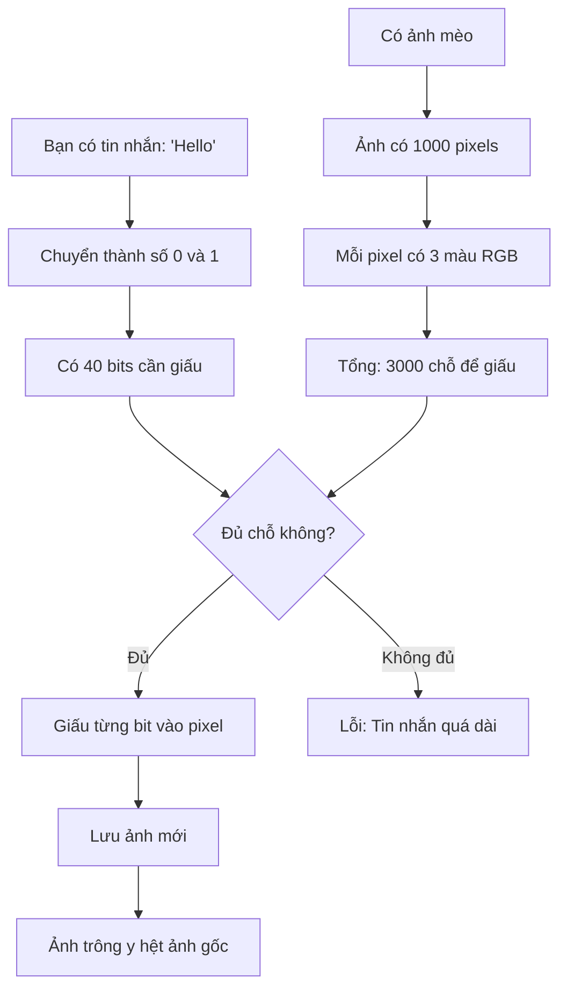
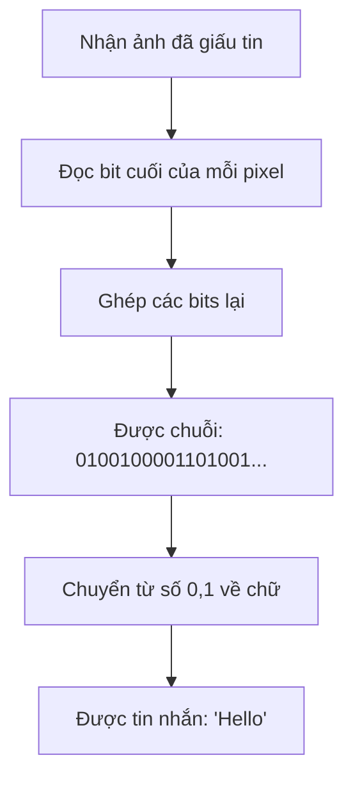

# 📖 Giải thích Đơn giản - Giấu tin trong Ảnh

> Viết cho người không chuyên IT

---

## 🤔 Giấu tin là gì?

**Tưởng tượng:** Bạn muốn gửi tin nhắn bí mật cho bạn, nhưng không muốn ai biết bạn đang gửi tin.

**Giải pháp:** Giấu tin nhắn vào trong một bức ảnh bình thường!

**Kết quả:** 
- Người khác chỉ thấy ảnh bình thường
- Chỉ người nhận (biết cách) mới lấy được tin nhắn

---

## 🎨 Ảnh trên máy tính là gì?

### Ảnh = Ma trận điểm màu (Pixels)

```
Ảnh 3×3 pixels:
┌─────┬─────┬─────┐
│ 🔴  │ 🟢  │ 🔵  │
├─────┼─────┼─────┤
│ 🟡  │ 🟣  │ 🟠  │
├─────┼─────┼─────┤
│ ⚪  │ ⚫  │ 🟤  │
└─────┴─────┴─────┘
```

### Mỗi pixel = 3 số (RGB)

```
Pixel đỏ = (255, 0, 0)
         = (R=255, G=0, B=0)
         
Pixel trắng = (255, 255, 255)
Pixel đen = (0, 0, 0)
```

### Số được lưu dưới dạng Binary (0 và 1)

```
Số 150 = 10010110 (8 bits)
         ^^^^^^^^
         |||||||└─ Bit cuối (LSB)
         
Thay đổi bit cuối:
150 = 10010110 → 10010111 = 151 (chỉ thay đổi +1)
```

**Quan trọng:** Thay đổi ±1 trong màu → Mắt người KHÔNG nhìn thấy khác biệt!

---

## 🔐 Cách Giấu tin hoạt động

### Bước 1: Chuyển tin nhắn thành số 0 và 1

```
Tin nhắn: "Hi"

'H' → Mã số 72 → Binary: 01001000
'i' → Mã số 105 → Binary: 01101001

Kết quả: 0100100001101001 (16 bits)
```

### Bước 2: Giấu từng bit vào pixel

```
Ảnh gốc:
Pixel 1: 150 = 10010110
Pixel 2: 200 = 11001000
Pixel 3: 100 = 01100100
...

Thay bit cuối của mỗi pixel = bit của tin nhắn:

Pixel 1: 10010110 → 10010110 (bit cuối = 0, giữ nguyên)
Pixel 2: 11001000 → 11001001 (bit cuối = 1, thay đổi)
Pixel 3: 01100100 → 01100100 (bit cuối = 0, giữ nguyên)
...

Ảnh sau khi giấu tin:
Pixel 1: 150 (không đổi)
Pixel 2: 201 (thay đổi +1)
Pixel 3: 100 (không đổi)
```

**Kết quả:** Ảnh trông y hệt ảnh gốc!

---

## 📊 Sơ đồ Quy trình

### Quy trình NHÚNG TIN



### Quy trình TRÍCH XUẤT



---

## 🎯 Ví dụ Cụ thể

### Tình huống: Alice gửi mật khẩu cho Bob

**Bước 1: Alice chuẩn bị**
```
Tin nhắn: "Pass123"
Ảnh: Ảnh mèo dễ thương (512×512 pixels)
```

**Bước 2: Alice giấu tin**
```
1. Mở app
2. Upload ảnh mèo
3. Nhập: "Pass123"
4. Tick "Mã hóa" (để bảo mật hơn)
5. Nhập mật khẩu: "secret"
6. Click "Nhúng"
7. Tải ảnh mới về
```

**Bước 3: Alice gửi ảnh**
```
- Gửi ảnh qua email/Zalo/Facebook
- Hacker chặn được → Chỉ thấy ảnh mèo bình thường
- Không ai biết có tin nhắn ẩn bên trong!
```

**Bước 4: Bob nhận và đọc**
```
1. Mở app
2. Upload ảnh nhận được
3. Tick "Giải mã"
4. Nhập mật khẩu: "secret"
5. Click "Trích xuất"
6. Thấy: "Pass123"
```

---

## 🔒 Mã hóa là gì?

### Không mã hóa

```
Tin nhắn: "Hello"
↓ Giấu vào ảnh
Ảnh Stego

Nếu ai đó biết cách trích xuất → Đọc được "Hello"
```

### Có mã hóa

```
Tin nhắn: "Hello"
↓ Mã hóa với mật khẩu "abc123"
Tin đã mã hóa: "x9f2a8b..." (vô nghĩa)
↓ Giấu vào ảnh
Ảnh Stego

Nếu ai đó trích xuất → Chỉ thấy "x9f2a8b..." (vô nghĩa)
Chỉ người có mật khẩu "abc123" mới giải mã được!
```

**Giống như:** Khóa két sắt 2 lớp
- Lớp 1: Giấu tin trong ảnh
- Lớp 2: Mã hóa tin nhắn

---

## 📏 Capacity (Sức chứa)

### Tính toán đơn giản

```
Ảnh 512×512 pixels:
- Số pixels: 512 × 512 = 262,144 pixels
- Mỗi pixel có 3 màu (R, G, B)
- Tổng chỗ giấu: 262,144 × 3 = 786,432 bits

Chuyển sang ký tự:
786,432 bits ÷ 8 = 98,304 ký tự

→ Có thể giấu ~98,000 ký tự!
```

### So sánh

```
Ảnh 512×512: ~98,000 ký tự (cả quyển truyện ngắn!)
Ảnh 256×256: ~24,000 ký tự (vài trang A4)
Ảnh 100×100: ~3,700 ký tự (1 trang A4)
```

---

## 🎨 Tại sao không nhìn thấy?

### Thí nghiệm

```
Màu gốc:     RGB(150, 200, 100)
Màu sau:     RGB(151, 201, 100)

Chênh lệch:  +1   +1    0
```

**Hỏi:** Bạn có phân biệt được 2 màu này không?

**Đáp án:** KHÔNG! Mắt người không phân biệt được sự khác biệt ±1 trong 256 mức màu.

### Chứng minh bằng số

```
PSNR (Peak Signal-to-Noise Ratio):
- Ảnh gốc vs Ảnh giấu tin: 51 dB
- Ngưỡng "không nhìn thấy": >40 dB
- Kết luận: 51 > 40 → Không nhìn thấy!
```

---

## ⚠️ Hạn chế

### 1. Không bền với JPEG

```
Ảnh PNG (giấu tin) → Lưu lại thành JPEG → Mất tin nhắn!

Tại sao?
- JPEG nén ảnh → Thay đổi giá trị pixel
- Bit cuối bị thay đổi → Tin nhắn bị hỏng
```

**Giải pháp:** Luôn dùng PNG hoặc BMP!

### 2. Không bền với Crop (Cắt ảnh)

```
Ảnh giấu tin → Cắt bớt 1 phần → Mất một phần tin nhắn
```

### 3. Dễ bị phát hiện (nếu phân tích kỹ)

```
Chuyên gia có thể:
- Phân tích thống kê bit cuối
- Phát hiện có tin nhắn ẩn
- NHƯNG không đọc được nội dung (nếu có mã hóa)
```

---

## 🆚 So sánh với Thủy vân

| Tiêu chí | Giấu tin (Steganography) | Thủy vân (Watermark) |
|----------|-------------------------|----------------------|
| **Mục đích** | Gửi tin bí mật | Bảo vệ bản quyền |
| **Nội dung** | Tin nhắn dài | Logo ngắn |
| **Độ bền** | YẾU (mất khi nén JPEG) | MẠNH (chịu được JPEG) |
| **Ví dụ** | Gửi mật khẩu | Đóng dấu ảnh |

---

## 🎓 Tóm tắt

### Giấu tin hoạt động như thế nào?

1. **Chuyển tin nhắn thành số 0 và 1**
2. **Thay bit cuối của mỗi pixel = bit của tin nhắn**
3. **Lưu ảnh mới** (trông y hệt ảnh gốc)

### Tại sao không nhìn thấy?

- Chỉ thay đổi ±1 trong giá trị màu
- Mắt người không phân biệt được

### Khi nào dùng?

- ✅ Gửi tin nhắn bí mật
- ✅ Truyền mật khẩu an toàn
- ✅ Giao tiếp bí mật

### Khi nào KHÔNG dùng?

- ❌ Bảo vệ bản quyền (dùng Thủy vân)
- ❌ Gửi qua mạng xã hội (có thể nén JPEG)
- ❌ Cần độ bền cao

---

## 💡 Câu hỏi thường gặp

### Q: Ảnh có bị nặng hơn không?

**A:** KHÔNG! Kích thước file gần như không đổi (chênh vài KB).

### Q: Có thể giấu ảnh vào ảnh không?

**A:** KHÔNG! Chỉ giấu được TEXT. Muốn giấu ảnh → Dùng Thủy vân.

### Q: Có an toàn không?

**A:** 
- Không mã hóa: Ai biết cách trích xuất → Đọc được
- Có mã hóa: Cần mật khẩu mới đọc được → AN TOÀN

### Q: Gửi qua Facebook/Zalo có được không?

**A:** KHÔNG nên! Các app này tự động nén ảnh thành JPEG → Mất tin nhắn.

**Nên:** Gửi file PNG gốc qua email, Google Drive, Telegram.

### Q: Có thể giấu bao nhiêu chữ?

**A:** 
- Ảnh 512×512: ~98,000 ký tự
- Ảnh 256×256: ~24,000 ký tự
- Ảnh càng lớn → Giấu càng nhiều

---

## 🎯 Kết luận

**Giấu tin = Nghệ thuật giấu tin nhắn trong ảnh**

- Đơn giản: Thay bit cuối của pixel
- Vô hình: Không nhìn thấy khác biệt
- Hữu ích: Gửi tin bí mật an toàn

**Nhớ:** 
- Luôn dùng PNG/BMP
- Bật mã hóa để bảo mật
- Không gửi qua mạng xã hội

---

**Chúc bạn sử dụng thành công! 🎉**
