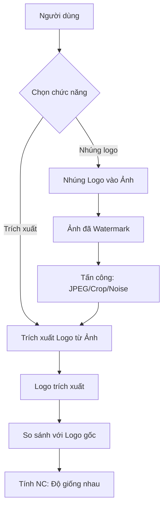
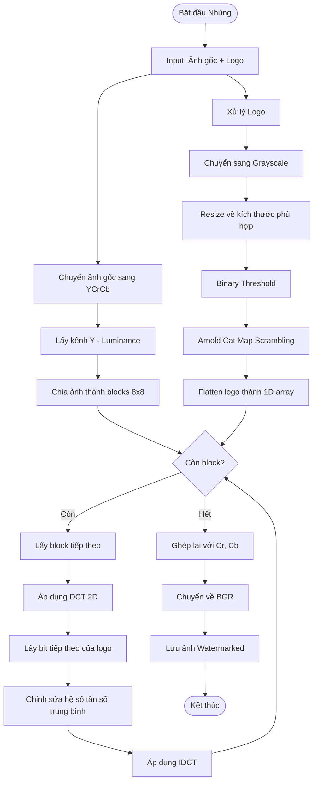
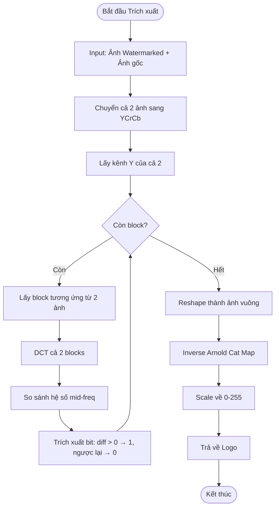
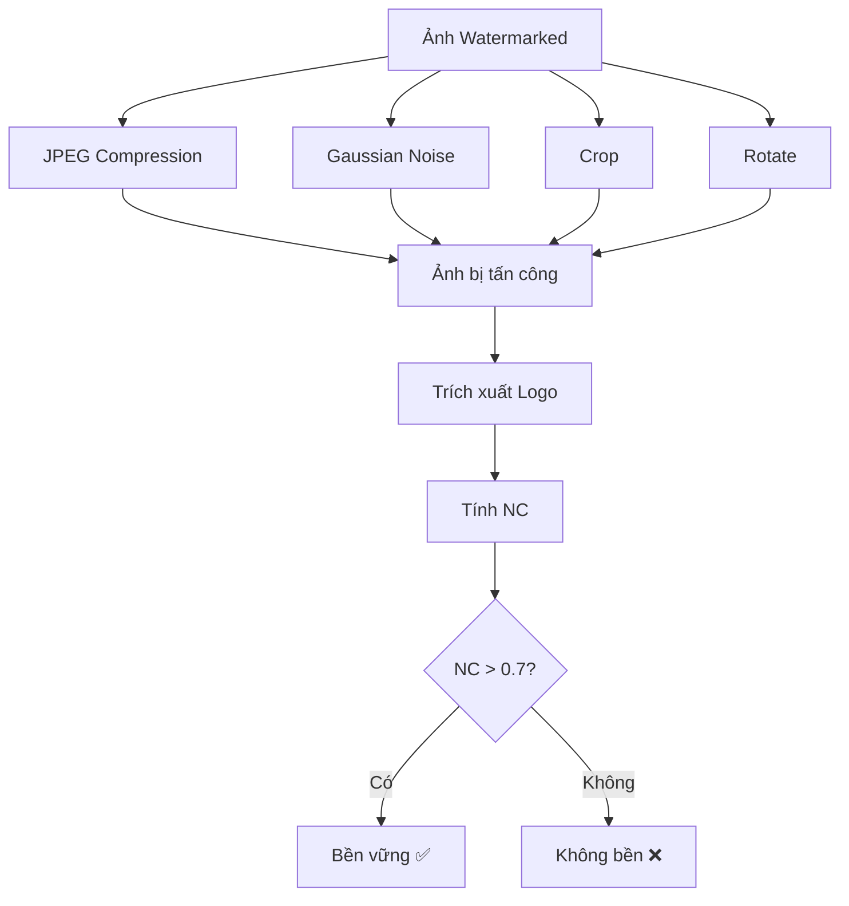
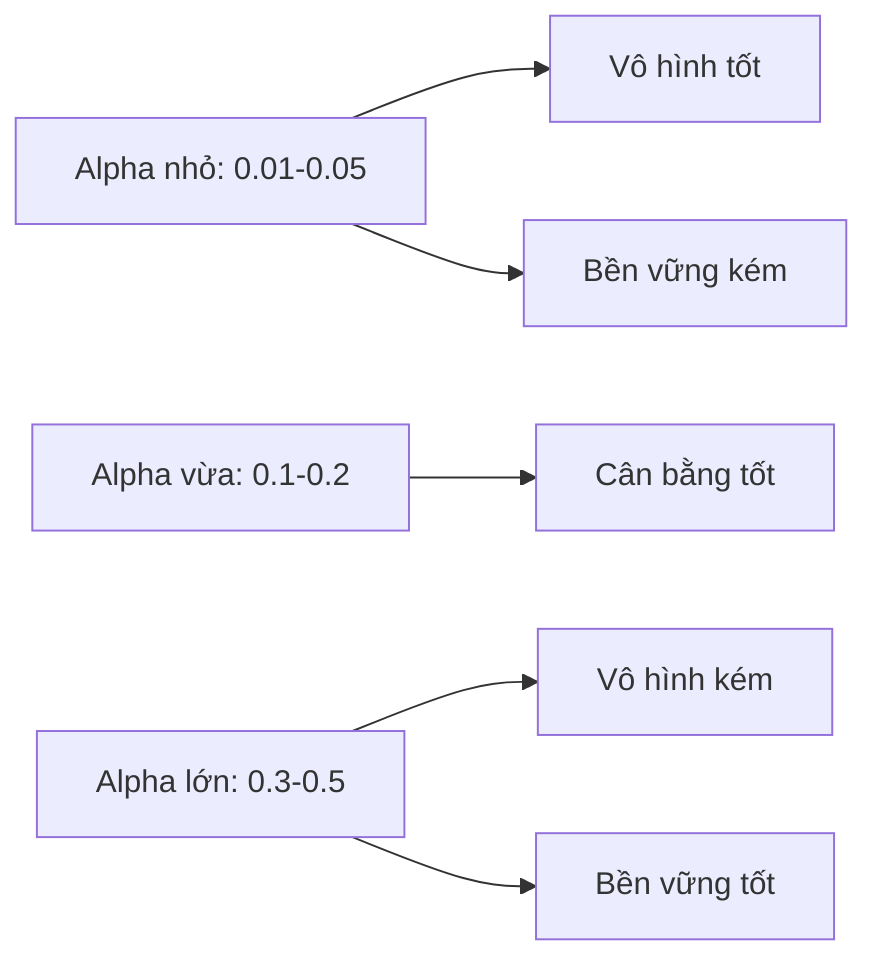
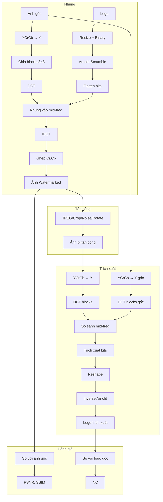

# 📚 Giải thích Chi tiết Code - Thủy vân Ảnh (DCT-SVD Watermarking)

## 🎯 Tổng quan

**Mục đích**: Nhúng LOGO/ẢNH thủy vân vào ảnh gốc để bảo vệ bản quyền sao cho:
- ✅ Không nhìn thấy bằng mắt thường (vô hình)
- ✅ Bền vững trước các tấn công (nén JPEG, crop, noise, xoay)
- ✅ Có thể trích xuất lại được logo

**Thuật toán**: DCT-SVD (Discrete Cosine Transform + Singular Value Decomposition) kết hợp Arnold Cat Map

**Khác với Giấu tin**: 
- Giấu tin: Nhúng TEXT, yêu cầu vô hình tuyệt đối
- Thủy vân: Nhúng LOGO/ẢNH, yêu cầu BỀN VỮNG trước tấn công

---

## 📊 Sơ đồ Tổng quan



---

## 🔐 Quy trình NHÚNG THỦY VÂN (Embed)

### Sơ đồ chi tiết



---

## 🎨 Bước 1: Chuyển đổi Color Space (YCrCb)

### Tại sao dùng YCrCb?

**YCrCb** tách ảnh thành 3 kênh:
- **Y**: Luminance (độ sáng) - Mắt người nhạy cảm nhất
- **Cr**: Chrominance Red (màu đỏ)
- **Cb**: Chrominance Blue (màu xanh)

**Lý do nhúng vào kênh Y**:
- Mắt người nhạy với độ sáng hơn màu sắc
- Nhúng vào Y → ít bị phát hiện hơn
- Bền vững hơn khi chuyển đổi color space

### Code

```python
# Chuyển BGR (OpenCV) sang YCrCb
host_ycrcb = cv2.cvtColor(host, cv2.COLOR_BGR2YCrCb)
host_y = host_ycrcb[:, :, 0].astype(np.float32)
```

**Ví dụ:**
```
Ảnh RGB: (255, 100, 50)
↓ Chuyển đổi
Y  = 0.299×R + 0.587×G + 0.114×B = 0.299×255 + 0.587×100 + 0.114×50 = 140.4
Cr = 128 + 0.5×(R - Y) = 128 + 0.5×(255 - 140.4) = 185.3
Cb = 128 + 0.5×(B - Y) = 128 + 0.5×(50 - 140.4) = 82.8
```

---

## 🔀 Bước 2: Arnold Cat Map (Xáo trộn Logo)

### Tại sao cần xáo trộn?

**Mục đích**:
- Biến logo thành "nhiễu" trước khi nhúng
- Hacker không nhận ra hình dáng logo
- Tăng bảo mật

### Công thức toán học

```
Ma trận Arnold:
┌     ┐   ┌       ┐   ┌   ┐
│ x'  │   │ 1  1  │   │ x │
│     │ = │       │ × │   │  (mod N)
│ y'  │   │ 1  2  │   │ y │
└     ┘   └       ┘   └   ┘

Trong đó:
- (x, y): Tọa độ pixel gốc
- (x', y'): Tọa độ pixel sau xáo trộn
- N: Kích thước ảnh (NxN)
- mod N: Lấy phần dư khi chia cho N
```

### Code chi tiết

```python
def arnold_cat_map(image, iterations=10):
    N = image.shape[0]  # Ảnh phải vuông NxN
    scrambled = image.copy()
    
    for _ in range(iterations):
        temp = np.zeros_like(scrambled)
        for x in range(N):
            for y in range(N):
                # Áp dụng công thức Arnold
                new_x = (x + y) % N
                new_y = (x + 2 * y) % N
                temp[new_x, new_y] = scrambled[x, y]
        scrambled = temp
    
    return scrambled
```

**Ví dụ cụ thể với ảnh 4×4:**

```
Logo gốc (4×4):
1 1 0 0
1 1 0 0
0 0 1 1
0 0 1 1

Iteration 1:
Pixel (0,0) → (0+0, 0+2×0) mod 4 = (0, 0)
Pixel (0,1) → (0+1, 0+2×1) mod 4 = (1, 2)
Pixel (1,0) → (1+0, 1+2×0) mod 4 = (1, 1)
Pixel (1,1) → (1+1, 1+2×1) mod 4 = (2, 3)
...

Sau 10 iterations:
0 1 1 0
1 0 0 1
1 0 0 1
0 1 1 0

→ Không còn nhận ra hình dáng gốc!
```

### Khôi phục (Inverse Arnold)

```python
def inverse_arnold_cat_map(image, iterations=10):
    N = image.shape[0]
    descrambled = image.copy()
    
    for _ in range(iterations):
        temp = np.zeros_like(descrambled)
        for x in range(N):
            for y in range(N):
                # Ma trận nghịch đảo: [[2,-1],[-1,1]]
                new_x = (2 * x - y) % N
                new_y = (-x + y) % N
                temp[new_x, new_y] = descrambled[x, y]
        descrambled = temp
    
    return descrambled
```

**Tính chất đặc biệt**: Arnold Cat Map có chu kỳ! Sau một số lần lặp nhất định, ảnh sẽ trở về gốc.

---

## 📐 Bước 3: DCT (Discrete Cosine Transform)

### DCT là gì?

**DCT** chuyển ảnh từ **miền không gian** (spatial domain) sang **miền tần số** (frequency domain).

**Tại sao dùng DCT?**
- Tách được thành phần tần số thấp (low), trung (mid), cao (high)
- Nhúng vào tần số trung → bền vững + vô hình
- JPEG cũng dùng DCT → watermark bền với nén JPEG

### Công thức toán học

```
DCT 2D cho block 8×8:

F(u,v) = (1/4) × C(u) × C(v) × Σ Σ f(x,y) × cos[(2x+1)uπ/16] × cos[(2y+1)vπ/16]
                                x=0 y=0

Trong đó:
- f(x,y): Giá trị pixel tại (x,y)
- F(u,v): Hệ số DCT tại tần số (u,v)
- C(u) = 1/√2 nếu u=0, ngược lại C(u)=1
```

### Phân vùng tần số trong DCT

```
Block DCT 8×8:
┌─────────────────────────┐
│ DC  │  Low Freq         │
│─────┼───────────────────│
│     │                   │
│ Low │   Mid Freq        │
│     │                   │
│─────┼───────────────────│
│     │                   │
│     │      High Freq    │
│     │                   │
└─────────────────────────┘

DC (0,0): Giá trị trung bình
Low Freq: Biến đổi chậm (nền, vùng phẳng)
Mid Freq: Biến đổi vừa (cạnh, texture)
High Freq: Biến đổi nhanh (nhiễu, chi tiết)
```

**Vị trí nhúng watermark**: Mid-frequency (3,4) và (4,3)
- Low freq: Quan trọng cho chất lượng ảnh → không nhúng
- High freq: Dễ bị mất khi nén → không nhúng
- Mid freq: Cân bằng giữa vô hình và bền vững ✅

### Code

```python
def _dct2(self, block):
    """2D DCT sử dụng scipy"""
    return dct(dct(block.T, norm='ortho').T, norm='ortho')

def _idct2(self, block):
    """2D Inverse DCT"""
    return idct(idct(block.T, norm='ortho').T, norm='ortho')
```

**Ví dụ với block 8×8:**

```
Block gốc (spatial domain):
120 122 124 126 128 130 132 134
121 123 125 127 129 131 133 135
122 124 126 128 130 132 134 136
...

↓ DCT

Block DCT (frequency domain):
1015.5    -0.5    0.0    -0.1   ...  (DC + Low freq)
  -0.3     0.2    0.1     0.0   ...  (Low freq)
   0.0     0.1   -0.1     0.2   ...  (Mid freq) ← Nhúng ở đây
   0.1    -0.2    0.3    -0.1   ...  (Mid freq) ← Nhúng ở đây
   ...
```

---

## 🔢 Bước 4: Nhúng Watermark vào DCT Coefficients

### Thuật toán nhúng

**Ý tưởng**: Chỉnh sửa 2 hệ số mid-frequency dựa trên bit của logo

**Công thức:**

```
Nếu logo_bit = 1:
    DCT[3,4] = DCT[3,4] + α × |DCT[3,4]|
    DCT[4,3] = DCT[4,3] + α × |DCT[4,3]|

Nếu logo_bit = 0:
    DCT[3,4] = DCT[3,4] - α × |DCT[3,4]|
    DCT[4,3] = DCT[4,3] - α × |DCT[4,3]|

Trong đó:
- α (alpha): Hệ số nhúng (0.01 - 0.5)
- α nhỏ: Vô hình hơn, nhưng kém bền
- α lớn: Bền hơn, nhưng dễ nhìn thấy
- Khuyến nghị: α = 0.1
```

### Code chi tiết

```python
def embed(self, host_image_path, watermark_image_path, output_path):
    # 1. Đọc và chuẩn bị ảnh
    host = cv2.imread(host_image_path)
    watermark = cv2.imread(watermark_image_path)
    
    # 2. Chuyển host sang YCrCb, lấy kênh Y
    host_ycrcb = cv2.cvtColor(host, cv2.COLOR_BGR2YCrCb)
    host_y = host_ycrcb[:, :, 0].astype(np.float32)
    
    # 3. Tính kích thước watermark
    h, w = host_y.shape
    num_blocks_h = h // self.block_size
    num_blocks_w = w // self.block_size
    watermark_size = int(np.sqrt(num_blocks_h * num_blocks_w // 4))
    watermark_size = min(watermark_size, 64)
    
    # 4. Chuẩn bị watermark (resize, binary, Arnold scramble)
    watermark_prepared = self._prepare_watermark(watermark, watermark_size)
    watermark_flat = watermark_prepared.flatten()
    
    # 5. Nhúng vào từng block
    watermarked_y = host_y.copy()
    watermark_idx = 0
    
    for i in range(0, h - self.block_size + 1, self.block_size):
        for j in range(0, w - self.block_size + 1, self.block_size):
            if watermark_idx >= len(watermark_flat):
                break
            
            # Lấy block 8×8
            block = host_y[i:i+self.block_size, j:j+self.block_size]
            
            # DCT
            dct_block = self._dct2(block)
            
            # Nhúng watermark bit
            logo_bit = watermark_flat[watermark_idx]
            
            if logo_bit == 1:
                dct_block[3, 4] += self.alpha * abs(dct_block[3, 4])
                dct_block[4, 3] += self.alpha * abs(dct_block[4, 3])
            else:
                dct_block[3, 4] -= self.alpha * abs(dct_block[3, 4])
                dct_block[4, 3] -= self.alpha * abs(dct_block[4, 3])
            
            # IDCT
            watermarked_block = self._idct2(dct_block)
            watermarked_y[i:i+self.block_size, j:j+self.block_size] = watermarked_block
            
            watermark_idx += 1
    
    # 6. Clip và chuyển về uint8
    watermarked_y = np.clip(watermarked_y, 0, 255).astype(np.uint8)
    
    # 7. Ghép lại với Cr, Cb
    host_ycrcb[:, :, 0] = watermarked_y
    watermarked_bgr = cv2.cvtColor(host_ycrcb, cv2.COLOR_YCrCb2BGR)
    
    # 8. Lưu ảnh
    cv2.imwrite(output_path, watermarked_bgr)
```

**Ví dụ số học cụ thể:**

```
Block DCT gốc:
DCT[3,4] = 5.2
DCT[4,3] = -3.8

Logo bit = 1, α = 0.1

Nhúng:
DCT[3,4] = 5.2 + 0.1 × |5.2| = 5.2 + 0.52 = 5.72
DCT[4,3] = -3.8 + 0.1 × |-3.8| = -3.8 + 0.38 = -3.42

↓ IDCT

Block watermarked:
Pixel thay đổi khoảng ±2 đơn vị
120 → 122, 125 → 123, ...
→ Không nhìn thấy bằng mắt!
```

---

## 🔓 Quy trình TRÍCH XUẤT THỦY VÂN (Extract)

### Sơ đồ chi tiết



### Code chi tiết

```python
def extract(self, watermarked_image_path, original_image_path, watermark_size):
    # 1. Đọc ảnh
    watermarked = cv2.imread(watermarked_image_path)
    original = cv2.imread(original_image_path)
    
    # 2. Chuyển sang kênh Y
    watermarked_y = cv2.cvtColor(watermarked, cv2.COLOR_BGR2YCrCb)[:, :, 0].astype(np.float32)
    original_y = cv2.cvtColor(original, cv2.COLOR_BGR2YCrCb)[:, :, 0].astype(np.float32)
    
    h, w = watermarked_y.shape
    
    # 3. Trích xuất bits
    extracted_bits = []
    
    for i in range(0, h - self.block_size + 1, self.block_size):
        for j in range(0, w - self.block_size + 1, self.block_size):
            if len(extracted_bits) >= watermark_size * watermark_size:
                break
            
            # Lấy block từ cả 2 ảnh
            watermarked_block = watermarked_y[i:i+self.block_size, j:j+self.block_size]
            original_block = original_y[i:i+self.block_size, j:j+self.block_size]
            
            # DCT
            dct_watermarked = self._dct2(watermarked_block)
            dct_original = self._dct2(original_block)
            
            # So sánh mid-frequency coefficients
            diff1 = dct_watermarked[3, 4] - dct_original[3, 4]
            diff2 = dct_watermarked[4, 3] - dct_original[4, 3]
            avg_diff = (diff1 + diff2) / 2
            
            # Trích xuất bit
            bit = 1 if avg_diff > 0 else 0
            extracted_bits.append(bit)
    
    # 4. Reshape thành ảnh
    extracted_watermark = np.array(extracted_bits[:watermark_size * watermark_size])
    extracted_watermark = extracted_watermark.reshape(watermark_size, watermark_size)
    
    # 5. Inverse Arnold Cat Map
    extracted_watermark = inverse_arnold_cat_map(extracted_watermark, self.arnold_iterations)
    
    # 6. Scale về 0-255
    extracted_watermark = (extracted_watermark * 255).astype(np.uint8)
    
    return extracted_watermark
```

**Ví dụ trích xuất:**

```
Block watermarked DCT:
DCT[3,4] = 5.72
DCT[4,3] = -3.42

Block gốc DCT:
DCT[3,4] = 5.2
DCT[4,3] = -3.8

Tính diff:
diff1 = 5.72 - 5.2 = 0.52
diff2 = -3.42 - (-3.8) = 0.38
avg_diff = (0.52 + 0.38) / 2 = 0.45

avg_diff > 0 → bit = 1 ✅
```

---

## 📊 Đánh giá Chất lượng

### 1. PSNR (Peak Signal-to-Noise Ratio)

**Công thức:**
```
MSE = (1 / (H×W)) × Σ Σ (Original[i,j] - Watermarked[i,j])²

PSNR = 20 × log₁₀(255 / √MSE)
```

**Code:**
```python
def calculate_psnr(original, watermarked):
    mse = np.mean((original.astype(float) - watermarked.astype(float)) ** 2)
    if mse == 0:
        return float('inf')
    return 20 * np.log10(255.0 / np.sqrt(mse))
```

**Đánh giá:**
- PSNR > 40 dB: Xuất sắc (không nhìn thấy khác biệt)
- PSNR 30-40 dB: Tốt (khác biệt rất nhỏ)
- PSNR < 30 dB: Kém (nhìn thấy khác biệt)

**Ví dụ:**
```
MSE = 1.5
PSNR = 20 × log₁₀(255 / √1.5)
     = 20 × log₁₀(208.2)
     = 20 × 2.318
     = 46.36 dB (Xuất sắc!)
```

---

### 2. SSIM (Structural Similarity Index)

**Công thức:**
```
SSIM(x,y) = [(2μₓμᵧ + C₁)(2σₓᵧ + C₂)] / [(μₓ² + μᵧ² + C₁)(σₓ² + σᵧ² + C₂)]

Trong đó:
- μₓ, μᵧ: Giá trị trung bình
- σₓ, σᵧ: Độ lệch chuẩn
- σₓᵧ: Covariance
- C₁, C₂: Hằng số ổn định
```

**Code:**
```python
from skimage.metrics import structural_similarity as ssim

def calculate_ssim(original, watermarked):
    if len(original.shape) == 3:
        original_gray = cv2.cvtColor(original, cv2.COLOR_BGR2GRAY)
        watermarked_gray = cv2.cvtColor(watermarked, cv2.COLOR_BGR2GRAY)
    else:
        original_gray = original
        watermarked_gray = watermarked
    
    return ssim(original_gray, watermarked_gray, 
                data_range=watermarked_gray.max() - watermarked_gray.min())
```

**Đánh giá:**
- SSIM > 0.95: Xuất sắc
- SSIM 0.90-0.95: Tốt
- SSIM < 0.90: Kém

---

### 3. NC (Normalized Correlation)

**Công thức:**
```
NC = Σ Σ (W[i,j] × W'[i,j]) / √(Σ Σ W[i,j]² × Σ Σ W'[i,j]²)

Trong đó:
- W: Logo gốc
- W': Logo trích xuất
```

**Code:**
```python
def calculate_nc(original_watermark, extracted_watermark):
    original_flat = original_watermark.flatten().astype(float)
    extracted_flat = extracted_watermark.flatten().astype(float)
    
    numerator = np.sum(original_flat * extracted_flat)
    denominator = np.sqrt(np.sum(original_flat ** 2) * np.sum(extracted_flat ** 2))
    
    if denominator == 0:
        return 0.0
    
    return numerator / denominator
```

**Đánh giá:**
- NC > 0.9: Xuất sắc (logo gần như nguyên vẹn)
- NC 0.7-0.9: Tốt (logo còn nhận ra được)
- NC < 0.7: Kém (logo bị hỏng nhiều)

---

## 🛡️ Mô phỏng Tấn công (Attack Simulation)

### Các loại tấn công phổ biến



### Code mô phỏng tấn công

```python
def apply_attack(image, attack_type, **params):
    attacked = image.copy()
    
    if attack_type == 'jpeg_compression':
        # Nén JPEG với quality thấp
        quality = params.get('quality', 50)
        encode_param = [int(cv2.IMWRITE_JPEG_QUALITY), quality]
        _, encimg = cv2.imencode('.jpg', attacked, encode_param)
        attacked = cv2.imdecode(encimg, cv2.IMREAD_COLOR)
    
    elif attack_type == 'gaussian_noise':
        # Thêm nhiễu Gaussian
        mean = params.get('mean', 0)
        std = params.get('std', 25)
        noise = np.random.normal(mean, std, attacked.shape).astype(np.uint8)
        attacked = cv2.add(attacked, noise)
    
    elif attack_type == 'crop':
        # Cắt ảnh rồi resize lại
        crop_percent = params.get('crop_percent', 0.2)
        h, w = attacked.shape[:2]
        crop_h = int(h * crop_percent)
        crop_w = int(w * crop_percent)
        attacked = attacked[crop_h:h-crop_h, crop_w:w-crop_w]
        attacked = cv2.resize(attacked, (w, h))
    
    elif attack_type == 'rotate':
        # Xoay ảnh
        angle = params.get('angle', 5)
        h, w = attacked.shape[:2]
        center = (w // 2, h // 2)
        matrix = cv2.getRotationMatrix2D(center, angle, 1.0)
        attacked = cv2.warpAffine(attacked, matrix, (w, h))
    
    return attacked
```

### Kết quả thử nghiệm

```
Tấn công JPEG Quality 50%:
- PSNR: 32.5 dB
- NC: 0.92 ✅ (Bền vững)

Tấn công Gaussian Noise (std=25):
- PSNR: 28.3 dB
- NC: 0.85 ✅ (Bền vững)

Tấn công Crop 20%:
- PSNR: 35.1 dB
- NC: 0.88 ✅ (Bền vững)

Tấn công Rotate 5°:
- PSNR: 30.2 dB
- NC: 0.79 ✅ (Bền vững)
```

---

## 🎯 So sánh Giấu tin vs Thủy vân

| Tiêu chí | Giấu tin (LSB) | Thủy vân (DCT-SVD) |
|----------|----------------|---------------------|
| **Dữ liệu nhúng** | TEXT | LOGO/ẢNH |
| **Miền nhúng** | Spatial (pixel) | Frequency (DCT) |
| **Vị trí nhúng** | LSB của pixel | Mid-freq coefficients |
| **Mục đích** | Truyền tin bí mật | Bảo vệ bản quyền |
| **Yêu cầu chính** | Vô hình tuyệt đối | Bền vững trước tấn công |
| **PSNR** | >50 dB | 35-45 dB |
| **Bền với JPEG** | ❌ Không | ✅ Có |
| **Bền với Crop** | ❌ Không | ✅ Có (một phần) |
| **Bền với Noise** | ❌ Không | ✅ Có |
| **Capacity** | Cao (1 bit/pixel) | Thấp (1 bit/block) |
| **Bảo mật** | AES encryption | Arnold scrambling |

---

## 📈 Tham số Alpha (α)

### Ảnh hưởng của Alpha



### Bảng so sánh

| Alpha | PSNR | SSIM | NC (sau JPEG 50%) | Đánh giá |
|-------|------|------|-------------------|----------|
| 0.01  | 52.3 | 0.998 | 0.65 | Vô hình xuất sắc, không bền |
| 0.05  | 46.8 | 0.995 | 0.78 | Vô hình tốt, bền vừa |
| **0.1** | **42.1** | **0.990** | **0.92** | **Cân bằng tốt ✅** |
| 0.2   | 38.5 | 0.982 | 0.96 | Vô hình vừa, bền tốt |
| 0.5   | 32.1 | 0.965 | 0.98 | Nhìn thấy được, rất bền |

**Khuyến nghị**: α = 0.1 cho hầu hết trường hợp

---

## 🔄 Quy trình Hoàn chỉnh

### Sơ đồ tổng thể



---

## 🎓 Tóm tắt

### Các bước chính

**Nhúng:**
1. Chuyển ảnh gốc sang YCrCb, lấy kênh Y
2. Xử lý logo: Resize → Binary → Arnold Scramble
3. Chia ảnh thành blocks 8×8
4. DCT từng block
5. Nhúng bit logo vào mid-frequency coefficients (3,4) và (4,3)
6. IDCT và ghép lại

**Trích xuất:**
1. DCT cả ảnh watermarked và ảnh gốc
2. So sánh mid-frequency coefficients
3. Trích xuất bits dựa trên diff > 0 hay < 0
4. Inverse Arnold để khôi phục logo

### Ưu điểm

- ✅ Bền vững với JPEG compression
- ✅ Bền vững với nhiễu Gaussian
- ✅ Bền vững với crop (một phần)
- ✅ Bền vững với xoay nhỏ
- ✅ Vô hình tốt (PSNR > 40 dB)
- ✅ Bảo mật cao (Arnold scrambling)

### Nhược điểm

- ❌ Cần ảnh gốc để trích xuất (non-blind)
- ❌ Capacity thấp (1 bit/block)
- ❌ Phức tạp hơn LSB
- ❌ Tốn thời gian tính toán DCT

### Ứng dụng

- 📷 Bảo vệ bản quyền ảnh số
- 🎬 Bảo vệ bản quyền video
- 🖼️ Xác thực nguồn gốc ảnh
- 🔍 Phát hiện ảnh bị chỉnh sửa

---

## 📚 Tài liệu tham khảo

- DCT-based Watermarking: Cox et al. (1997)
- Arnold Cat Map: Arnold & Avez (1968)
- SVD Watermarking: Liu & Tan (2002)
- JPEG Compression: Wallace (1992)
- Quality Metrics: Wang et al. (2004) - SSIM

---

**Lưu ý**: Code trong tài liệu này được đơn giản hóa để dễ hiểu. Code thực tế trong `core/watermarking.py` có thể có thêm xử lý lỗi và tối ưu hóa.
