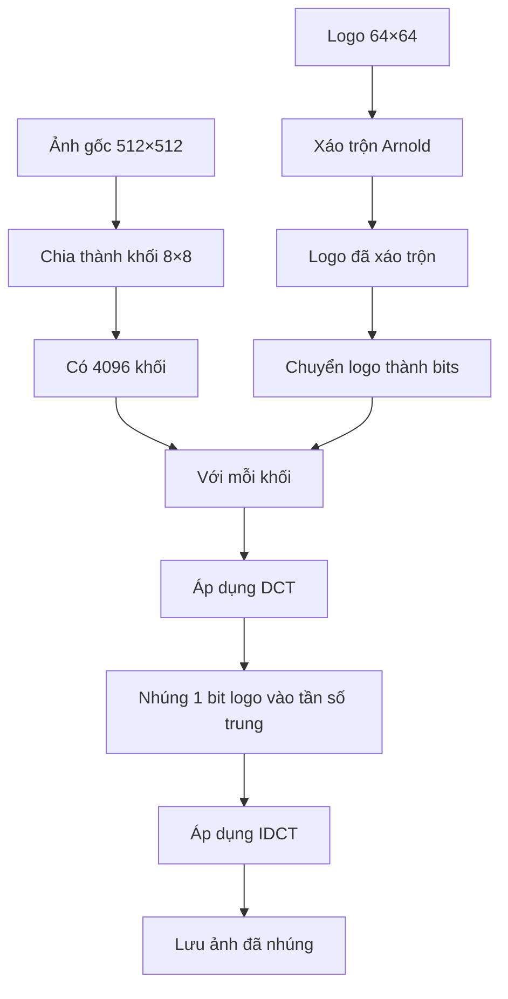
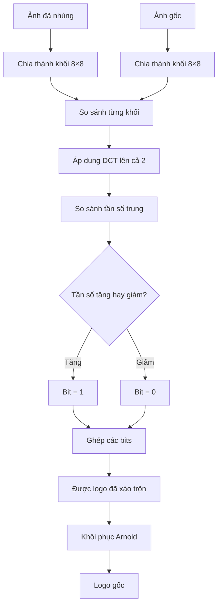

# 📖 Giải thích Đơn giản - Nhúng Thủy vân vào Ảnh

> Viết cho người không chuyên IT

---

## 🤔 Thủy vân là gì?

**Tưởng tượng:** Bạn là nhiếp ảnh gia, chụp ảnh đẹp. Sợ người khác lấy ảnh của bạn đi bán.

**Giải pháp:** Nhúng "chữ ký" vô hình vào ảnh!

**Kết quả:**
- Ảnh trông bình thường
- Khi ai đó đánh cắp → Bạn trích xuất chữ ký → Chứng minh ảnh là của bạn
- Chữ ký vẫn còn ngay cả khi ảnh bị nén, cắt, thêm nhiễu!

---

## 🆚 Khác với Giấu tin như thế nào?

### Giấu tin (Steganography)

```
Mục đích: Gửi tin BÍ MẬT
Nội dung: Tin nhắn TEXT dài
Độ bền: YẾU (mất khi nén JPEG)

Ví dụ: Gửi mật khẩu cho bạn
```

### Thủy vân (Watermark)

```
Mục đích: BẢO VỆ BẢN QUYỀN
Nội dung: Logo/chữ ký NGẮN
Độ bền: MẠNH (chịu được JPEG, crop, noise)

Ví dụ: Đóng dấu ảnh của bạn
```

### So sánh đời thường

| Giấu tin | Thủy vân |
|----------|----------|
| Viết thư bí mật bằng mực tàng hình | Đóng dấu giấy tờ quan trọng |
| Giấu kim trong đống cỏ khô | Khắc tên lên đồ vật |
| Gửi tin nhắn bí mật | Chứng minh quyền sở hữu |

---

## 🎨 Thủy vân hoạt động như thế nào?

### Bước 1: Chuẩn bị

```
Có:
- Ảnh gốc: Ảnh phong cảnh đẹp (512×512)
- Logo: Chữ ký của bạn (64×64)

Muốn:
- Nhúng logo VÔ HÌNH vào ảnh
- Logo vẫn còn ngay cả khi ảnh bị nén/cắt
```

### Bước 2: Xáo trộn Logo (Arnold Cat Map)

```
Logo gốc:        Logo sau xáo trộn:
┌─────┐          ┌─────┐
│ ABC │          │ C A │
│ DEF │    →     │ F B │
│ GHI │          │ I D │
└─────┘          └─────┘

Tại sao?
- Để hacker không nhận ra hình dáng logo
- Tăng bảo mật
```

### Bước 3: Chuyển ảnh sang "Miền tần số"

**Giống như:** Phân tích âm thanh thành cao-trung-thấp

```
Ảnh gốc:
┌──────────────┐
│ Pixel Pixel  │
│ Pixel Pixel  │  → Miền không gian
└──────────────┘

Sau DCT:
┌──────────────┐
│ Tần số thấp  │ ← Thông tin chính (hình dạng)
│ Tần số trung │ ← Nhúng logo VÀO ĐÂY!
│ Tần số cao   │ ← Chi tiết, nhiễu
└──────────────┘
```

**Tại sao nhúng vào tần số trung?**
- Tần số thấp: Quan trọng → Thay đổi → Ảnh bị méo
- Tần số cao: Dễ mất khi nén JPEG
- **Tần số trung**: Vừa ổn định, vừa không làm méo ảnh

### Bước 4: Nhúng Logo

```
Chia ảnh thành các khối 8×8:
┌───┬───┬───┐
│ 1 │ 2 │ 3 │
├───┼───┼───┤
│ 4 │ 5 │ 6 │
└───┴───┴───┘

Với mỗi khối:
1. Áp dụng DCT (chuyển sang tần số)
2. Lấy 1 bit của logo
3. Nếu bit = 1 → Tăng giá trị tần số trung
4. Nếu bit = 0 → Giảm giá trị tần số trung
5. Áp dụng IDCT (chuyển về pixel)
```

### Bước 5: Lưu ảnh

```
Ảnh đã nhúng thủy vân:
- Trông y hệt ảnh gốc
- Nhưng có "chữ ký" ẩn bên trong
- Chữ ký bền vững, khó xóa
```

---

## 📊 Sơ đồ Quy trình

### Quy trình NHÚNG



### Quy trình TRÍCH XUẤT



---

## 🎯 Ví dụ Cụ thể

### Tình huống: Nhiếp ảnh gia bảo vệ ảnh

**Bước 1: Chuẩn bị**
```
Ảnh: Phong cảnh Hạ Long (1024×768)
Logo: Chữ ký "© John 2026" (64×64)
```

**Bước 2: Nhúng thủy vân**
```
1. Mở app
2. Upload ảnh Hạ Long
3. Upload logo chữ ký
4. Chọn Alpha = 0.1 (độ mạnh)
5. Click "Nhúng"
6. Tải ảnh đã nhúng về
```

**Bước 3: Đăng ảnh lên mạng**
```
- Đăng lên Facebook, Instagram
- Ảnh trông bình thường
- Thủy vân ẩn bên trong
```

**Bước 4: Ai đó đánh cắp ảnh**
```
- Hacker download ảnh
- Đăng lại trên web của họ
- Nén JPEG, crop, thêm filter
```

**Bước 5: Chứng minh bản quyền**
```
1. Lấy ảnh bị đánh cắp
2. Mở app
3. Upload ảnh bị đánh cắp + ảnh gốc
4. Click "Trích xuất"
5. Thấy logo "© John 2026"
6. Chứng minh: Ảnh là của tôi!
```

---

## 🔧 Tham số Alpha

### Alpha là gì?

**Alpha = Độ mạnh của thủy vân**

```
Alpha nhỏ (0.01-0.05):
- Ưu: Rất vô hình, ảnh đẹp
- Nhược: Dễ mất khi bị tấn công

Alpha vừa (0.1):
- Ưu: Cân bằng tốt
- Nhược: Vừa vô hình, vừa bền
- → KHUYẾN NGHỊ!

Alpha lớn (0.3-0.5):
- Ưu: Rất bền, khó xóa
- Nhược: Có thể nhìn thấy (ảnh hơi xấu)
```

### So sánh

```
Alpha = 0.05:
PSNR = 45 dB (Xuất sắc)
Chịu JPEG Q=70 ✓
Chịu JPEG Q=50 ✗

Alpha = 0.1:
PSNR = 38 dB (Tốt)
Chịu JPEG Q=50 ✓
Chịu Crop 20% ✓
→ CHỌN CÁI NÀY!

Alpha = 0.3:
PSNR = 30 dB (Chấp nhận được)
Chịu JPEG Q=30 ✓
Chịu Crop 30% ✓
Nhưng ảnh hơi xấu ✗
```

---

## 🛡️ Độ bền của Thủy vân

### Test với các tấn công

#### 1. Nén JPEG

```
Ảnh gốc (PNG) → Lưu JPEG Q=50 → Thủy vân vẫn còn ✓

Tại sao?
- Thủy vân ở tần số trung
- JPEG chủ yếu xóa tần số cao
- Tần số trung ít bị ảnh hưởng
```

#### 2. Thêm nhiễu (Noise)

```
Ảnh gốc → Thêm nhiễu Gaussian → Thủy vân vẫn còn ✓

Tại sao?
- Nhiễu ảnh hưởng tần số cao
- Thủy vân ở tần số trung → An toàn
```

#### 3. Cắt xén (Crop)

```
Ảnh gốc → Cắt bớt 20% → Thủy vân vẫn còn (yếu hơn) ⚠️

Tại sao?
- Mất 20% khối → Mất 20% bits của logo
- Nhưng 80% còn lại vẫn nhận dạng được
```

#### 4. Xoay (Rotate)

```
Ảnh gốc → Xoay 5° → Thủy vân vẫn còn (yếu hơn) ⚠️

Tại sao?
- Xoay làm thay đổi vị trí khối
- Nhưng giá trị tần số ít thay đổi
```

### Bảng tổng hợp

| Tấn công | Alpha=0.05 | Alpha=0.1 | Alpha=0.3 |
|----------|------------|-----------|-----------|
| JPEG Q=70 | ✓ | ✓ | ✓ |
| JPEG Q=50 | ✗ | ✓ | ✓ |
| JPEG Q=30 | ✗ | ⚠️ | ✓ |
| Noise σ=25 | ⚠️ | ✓ | ✓ |
| Crop 20% | ✗ | ⚠️ | ✓ |
| Rotate 5° | ✗ | ⚠️ | ✓ |

**Kết luận:** Alpha = 0.1 là lựa chọn tốt nhất!

---

## 🔐 Arnold Cat Map (Xáo trộn)

### Tại sao cần xáo trộn?

**Không xáo trộn:**
```
Logo gốc:
┌─────┐
│  ©  │
│JOHN │
└─────┘

Nếu hacker trích xuất → Nhìn thấy ngay "© JOHN"
```

**Có xáo trộn:**
```
Logo sau xáo trộn:
┌─────┐
│▓▒░▓▒│
│░▓▒░▓│  ← Trông như nhiễu
│▒░▓▒░│
└─────┘

Hacker trích xuất → Chỉ thấy nhiễu, không hiểu gì!
```

### Cách hoạt động

```
Công thức toán học:
x_mới = (x + y) mod N
y_mới = (x + 2y) mod N

Ví dụ với ảnh 3×3:
Pixel (0,0) → (0,0)
Pixel (0,1) → (1,2)
Pixel (0,2) → (2,1)
Pixel (1,0) → (1,1)
...

Kết quả: Ảnh bị xáo trộn hoàn toàn!
```

### Đặc điểm

```
Lặp 10 lần:
Logo gốc → Xáo trộn 10 lần → Trông như nhiễu

Khôi phục:
Nhiễu → Xáo trộn ngược 10 lần → Logo gốc

Chu kỳ:
Với ảnh 64×64, sau ~48 lần xáo trộn → Trở về gốc!
```

---

## 📊 Đánh giá Chất lượng

### PSNR (Peak Signal-to-Noise Ratio)

**Là gì?** Đo độ khác biệt giữa ảnh gốc và ảnh đã nhúng

```
PSNR > 40 dB: Xuất sắc (không nhìn thấy khác biệt)
PSNR 30-40 dB: Tốt (khác biệt rất nhỏ)
PSNR 20-30 dB: Chấp nhận được
PSNR < 20 dB: Kém (nhìn thấy rõ khác biệt)
```

**Ví dụ:**
```
Alpha = 0.1 → PSNR = 38 dB → Tốt!
```

### SSIM (Structural Similarity Index)

**Là gì?** Đo độ giống nhau về cấu trúc

```
SSIM = 1.0: Giống hệt
SSIM > 0.95: Xuất sắc
SSIM > 0.90: Tốt
SSIM < 0.80: Kém
```

**Ví dụ:**
```
Alpha = 0.1 → SSIM = 0.96 → Xuất sắc!
```

### NC (Normalized Correlation)

**Là gì?** Đo độ giống nhau giữa logo gốc và logo trích xuất

```
NC = 1.0: Giống hệt
NC > 0.9: Xuất sắc (logo rất rõ)
NC > 0.7: Tốt (logo nhận dạng được)
NC < 0.5: Kém (logo bị hỏng)
```

**Ví dụ:**
```
Không tấn công: NC = 0.98 (Xuất sắc)
Sau JPEG Q=50: NC = 0.85 (Tốt)
Sau Crop 20%: NC = 0.72 (Chấp nhận được)
```

---

## ⚠️ Hạn chế

### 1. Cần ảnh gốc để trích xuất

```
Để trích xuất logo:
- Cần: Ảnh đã nhúng + Ảnh gốc
- So sánh 2 ảnh → Tìm ra logo

Nếu mất ảnh gốc → Không trích xuất được!
```

**Giải pháp:** Lưu ảnh gốc cẩn thận!

### 2. Không chịu được tấn công mạnh

```
Crop 50%: Logo bị hỏng nặng
Xoay 45°: Logo bị hỏng
Resize nhỏ: Logo bị mất
```

### 3. Chậm hơn Giấu tin

```
Giấu tin: ~0.1 giây
Thủy vân: ~2 giây (vì phải tính DCT)
```

---

## 💡 Câu hỏi thường gặp

### Q: Thủy vân có làm ảnh nặng hơn không?

**A:** KHÔNG! Kích thước file gần như không đổi.

### Q: Có thể nhúng ảnh màu không?

**A:** CÓ! Nhưng nên dùng logo đơn giản (đen trắng) để dễ nhận dạng.

### Q: Gửi qua Facebook có mất không?

**A:** Có thể mất một phần (Facebook nén mạnh). Nhưng vẫn nhận dạng được nếu Alpha đủ lớn.

### Q: Có thể nhúng nhiều logo không?

**A:** KHÔNG nên! Nhúng nhiều → Ảnh bị méo, logo lẫn lộn.

### Q: Khác với logo hiển thị như thế nào?

**A:**
- Logo hiển thị: Nhìn thấy rõ (như logo Getty Images)
- Thủy vân: VÔ HÌNH, chỉ trích xuất mới thấy

---

## 🎯 Kết luận

**Thủy vân = Đóng dấu vô hình lên ảnh**

### Ưu điểm:
- ✅ Bảo vệ bản quyền
- ✅ Bền với JPEG, noise, crop nhẹ
- ✅ Vô hình, không làm xấu ảnh

### Nhược điểm:
- ❌ Cần ảnh gốc để trích xuất
- ❌ Chậm hơn giấu tin
- ❌ Không chịu được tấn công mạnh

### Khi nào dùng?
- ✅ Bảo vệ ảnh của bạn
- ✅ Chứng minh bản quyền
- ✅ Đóng dấu sản phẩm

### Tham số khuyến nghị:
- **Alpha = 0.1** (cân bằng tốt)
- **Arnold iterations = 10** (bảo mật vừa đủ)
- **Logo đơn giản** (dễ nhận dạng)

---

**Chúc bạn bảo vệ ảnh thành công! 🎉**
